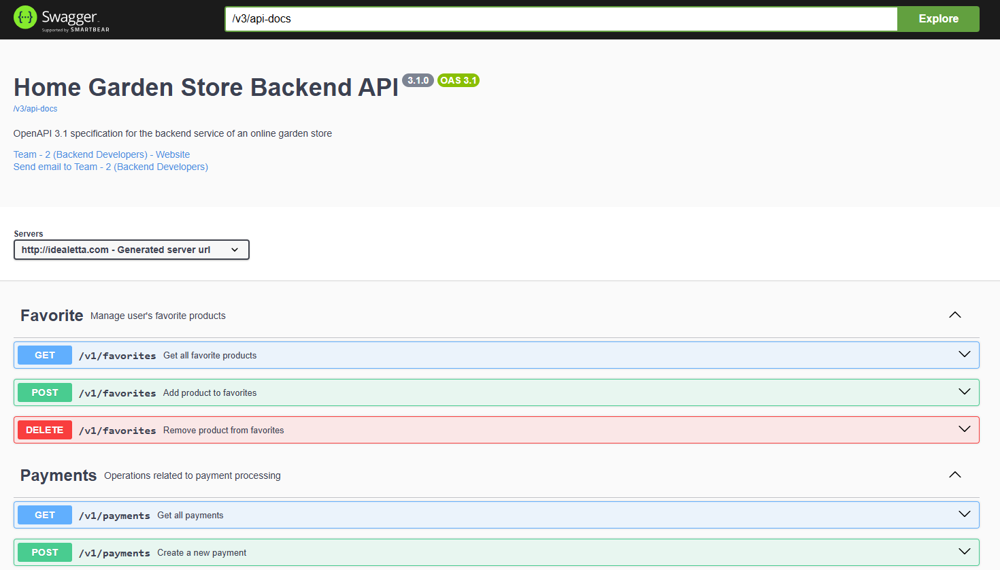

# 🏡 Home-Garden-Store

## 📖 About the Project
**Home-Garden-Store** is a full-stack web application for an online shop specializing in home and garden products.  
The project is built with **Java Spring Boot** and follows modern software design and architecture practices.

📌 [Technical Requirements](https://docs.google.com/document/d/1Xn41eFhdYAJVYzRucsNwpbLJ5lNxdvpfx__SZf5DwXA/edit?tab=t.0)  
📌 [Database Schema](https://drive.google.com/file/d/1NRoV9nKvoDe3pPekVjBC2s2S0MoK8C3I/view)  
📌 [Evaluation Criteria](https://docs.google.com/spreadsheets/d/16ANenVRBsCD-a21MtOQfWgFvxrI5oclL/edit?gid=513598127#gid=513598127)  
📌 [Deployed Version](http://idealetta.com/swagger-ui/index.html)

---

## 🖼️ Swagger Screenshot


---

## ⚡ Key Features

👤 **User Accounts** – registration, login, and profile management  
🛠️ **Admin Product Management** – add, update, or remove products from the catalog  
🔎 **Search & Filters** – advanced filtering and sorting for easy product discovery  
⭐ **Favorites** – save favorite products to a personalized list  
🛒 **Shopping Cart** – add items, update quantities, and manage selections  
📦 **Order Processing** – place orders and track their status in real time  
💳 **Payment** – mock payment integration for testing checkout flow  
🎁 **Discounts** – create and manage special deals  
📊 **Reports** – analytics on sales, cancellations, and unpaid orders


---

## 🛠 Tech Stack
⚙️ **Backend**: Java 17, Spring Boot, Spring Data JPA, Spring Security  
⚙️ **Database**: PostgreSQL, Liquibase (migrations)  
⚙️ **ORM**: Hibernate  
⚙️ **API Documentation**: Swagger / OpenAPI  
⚙️ **Testing**: JUnit, Mockito  
⚙️ **Build Tools**: Maven  
⚙️ **DevOps**: Docker, Docker Compose

---

## 👥 Project Authors

**[Mykhaylo Moisyeyenko](https://github.com/Mykhaylo-Moisyeyenko)**
- Added Liquibase for database initialization
- Created Favorite entity
- Implemented filtering and sorting
- Set up authentication with Spring Security + JWT
- Reporting module (top products, pending payment orders)
- Created ReportController and ReportService
- Docker environment configuration
- Deployed the project

**[Sofia Koriakina](https://github.com/sofia-kor)**
- Created User entity
- Created Global exception handler
- Created Order entity and all related layers
- Implemented Order creation with Cart Items
- Implemented Order Status updates via Scheduler

**[Elizaveta Erler](https://github.com/Elizaveta-Erler)** 
- Created Category entity
- Defined JPA relationships between User, Product, Favorite, and Category entities
- Implemented PaymentController to handle order payments
- Standardized code across similar methods in different classes
- Integrated Swagger (OpenAPI) for API documentation

**[Evgeny Luft](https://github.com/EvgenyLuft)**
- Created Product entity
- Implemented error handling 400 in ProductController for invalid input
- Wrote unit tests for ProductController and ProductServiceImpl
- Verified ProductController functionality via Swagger and Postman

---

## 🚀 How to Run
```bash
# Clone the repository
git clone https://github.com/Mykhaylo-Moisyeyenko/home-garden-store-backend.git

# Navigate into the project folder on server
cd /srv/home-garden-store

# Build and start with Docker
docker compose pull up
docker compose up -d app